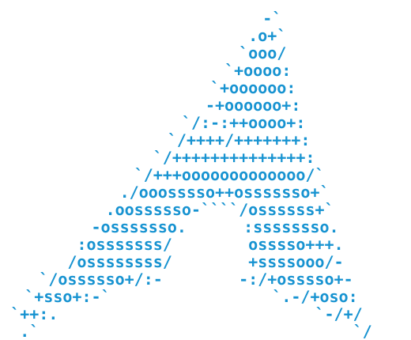

<p align="left">
  
</p>

# VM's Arch Build

My version-controlled, reproducible Arch Linux setup.

The goal is a lightweight, minimal system that can be rebuilt from scratch with as little manual configuration as possible. The current setup uses Sway and idles at roughly 550–650 MiB of memory with effectively zero CPU usage.

The repository contains everything needed to reproduce the system: package manifests, installation scripts, system configuration, and user dotfiles.

## Install

> **Warning:** the installer erases and repartitions the target disk. Make sure you specify the correct device.

### 1. Download Arch Linux

Download the latest Arch ISO from the [official Arch Linux download page](https://archlinux.org/download/).

Boot the machine from the ISO.

This setup assumes a **UEFI** system.

### 2. Connect to the internet

Verify connectivity:

```bash
ping -c 3 archlinux.org
```

A wired connection should normally work automatically.

### 3. Install Git

Git is not included in the Arch live environment:

```bash
pacman -Sy git
```

### 4. Clone this repository

```bash
git clone https://github.com/vincemaina/arch.git Arch
cd Arch
```

### 5. Identify the target disk

```bash
lsblk
```

For example, a virt-manager VM will commonly use:

```text
/dev/vda
```

A physical NVMe drive may instead look like:

```text
/dev/nvme0n1
```

### 6. Run the installer

```bash
./install.sh /dev/vda
```

Replace `/dev/vda` with the disk you actually want to install Arch onto.

The installer handles the rest, including:

* GPT/UEFI partitioning
* Btrfs and subvolumes
* Base Arch installation
* Locale, timezone and users
* NetworkManager
* systemd-boot
* Sway and desktop packages
* Development utilities
* User configuration and dotfiles

It will prompt for any information that should not be hardcoded, such as passwords.

When installation finishes, the machine powers off. Remove the Arch installation media and boot from the newly installed system.

After logging in:

```bash
sway
```

## Keeping a machine up to date

`install.sh` builds a machine. `sync.sh` updates one that already exists.

Once a machine is running, clone this repository onto it and run:

```bash
./sync.sh
```

That installs any package declared in `setup/packages/` that is missing,
re-applies the dotfiles, and reports what changed along with anything that
needs to restart before the change takes effect.

To see what it would do without changing anything:

```bash
./sync.sh --dry-run
```

Run it as your normal user, not as root — the dotfiles belong to your user, and
it uses `sudo` only to install packages.

It is safe to run repeatedly, and it never partitions disks, installs a
bootloader or creates users. Those belong to a fresh install. It also never
removes packages: anything installed by hand and not declared in
`setup/packages/` is left alone.

This is the normal day-to-day loop. Change the repository, run `sync.sh`, see
the result — no rebuild required.

## Design

The setup is intentionally:

* **Minimal** — install only what is useful.
* **Reproducible** — configuration should live in Git rather than depend on manual setup.
* **Understandable** — automation should remain simple enough to inspect and modify.
* **Modular** — packages, system configuration and user configuration are kept separate.
* **Safe to evolve** — a new VM can be used to test changes before applying them to a real machine.

For the reasoning behind major technical choices, see [`DECISIONS.md`](./DECISIONS.md).

For an overview of the installation process, see [`FLOW.md`](./FLOW.md).

## Structure

The project itself contains documentation, development notes and backlog items. Everything required to construct the Arch system lives under [`setup/`](./setup/).

| Area              | Purpose                                    | Managed by                      |
| ----------------- | ------------------------------------------ | ------------------------------- |
| `setup/packages/` | Software that should be installed          | `pacman` / installation scripts |
| `setup/install/`  | Steps used to build the system             | Shell scripts                   |
| `setup/system/`   | Machine-wide OS configuration              | Scripts and templates           |
| `setup/dotfiles/` | User environment and desktop configuration | chezmoi                         |

The root [`install.sh`](./install.sh) orchestrates these components into a complete
installation. The root [`sync.sh`](./sync.sh) applies the same components to a machine
that is already running.
